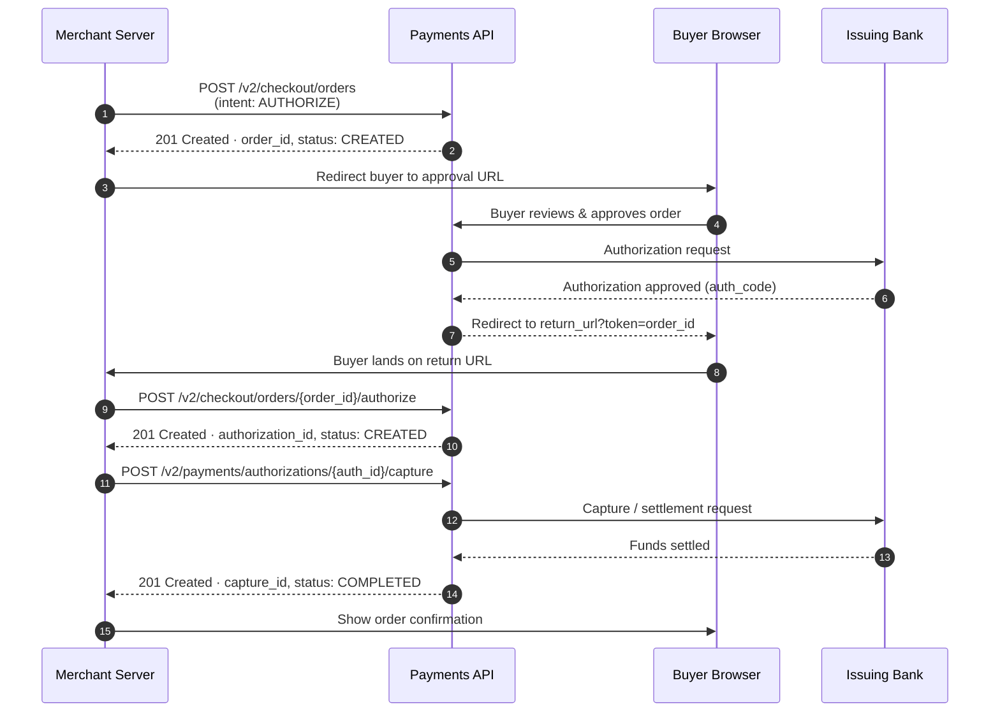

# Payment Capture Integration Guide

> **Audience:** Merchants and developers integrating card payment capture into their platforms.  
> **Prerequisites:** A Example Payments sandbox account, client credentials (client ID and secret), and a basic understanding of REST APIs.  
> **Related resources:** [Common Resources](./common-resources.md) · [Payments API Reference](./api-reference.md)

---

## Overview

This guide walks you through the complete lifecycle of a card payment — from creating an order to capturing funds — using the Payments API. By the end of this guide, you will be able to:

- Create and confirm a payment order.
- Redirect the buyer through the approval flow.
- Capture the authorized funds.
- Handle partial captures and voided authorizations.

---

## How it works

The payment capture flow follows a three-phase model: **authorization**, **approval**, and **capture**. These phases are designed to separate the act of reserving funds from the act of collecting them, allowing merchants flexibility in fulfilment workflows.



---

## Step 1 — Obtain an access token

Before making any API call, authenticate using your client credentials. Refer to the [Authentication](./common-resources.md#authentication) section in Common Resources for the full OAuth 2.0 flow.

```bash
curl -X POST https://api-m.sandbox.example.com/v1/oauth2/token \
  -H "Accept: application/json" \
  -H "Accept-Language: en_US" \
  -u "CLIENT_ID:CLIENT_SECRET" \
  -d "grant_type=client_credentials"
```

**Response (200 OK)**

```json
{
  "access_token": "A21AAxxxx",
  "token_type": "Bearer",
  "expires_in": 32400,
  "scope": "https://uri.example.com/services/payments/payment"
}
```

Store the `access_token` securely. It expires after the duration specified in `expires_in` (in seconds). Do not expose the token in client-side code.

---

## Step 2 — Create an order

Create an order with `intent` set to `AUTHORIZE`. This reserves the payment method without collecting funds immediately.

**Request**

```bash
curl -X POST https://api-m.sandbox.example.com/v2/checkout/orders \
  -H "Content-Type: application/json" \
  -H "Authorization: Bearer ACCESS_TOKEN" \
  -H "Example-Request-Id: 7b92603e-77ed-4896-8e78-5dea2050476a" \
  -d '{
    "intent": "AUTHORIZE",
    "purchase_units": [
      {
        "reference_id": "PU-001",
        "amount": {
          "currency_code": "USD",
          "value": "100.00",
          "breakdown": {
            "item_total": { "currency_code": "USD", "value": "90.00" },
            "shipping":   { "currency_code": "USD", "value": "10.00" }
          }
        },
        "description": "Premium Subscription — Annual Plan"
      }
    ],
    "application_context": {
      "return_url": "https://yoursite.com/checkout/return",
      "cancel_url": "https://yoursite.com/checkout/cancel",
      "brand_name": "Your Store",
      "user_action": "PAY_NOW"
    }
  }'
```

> **Note:** `Example-Request-Id` is an idempotency key. Reuse it to safely retry the same call without creating duplicate orders. See [Idempotency](./common-resources.md#idempotency) in Common Resources.

**Response (201 Created)**

```json
{
  "id": "5O190127TN364715T",
  "status": "CREATED",
  "links": [
    {
      "href": "https://api-m.sandbox.example.com/v2/checkout/orders/5O190127TN364715T",
      "rel": "self",
      "method": "GET"
    },
    {
      "href": "https://www.sandbox.example.com/checkoutnow?token=5O190127TN364715T",
      "rel": "approve",
      "method": "GET"
    },
    {
      "href": "https://api-m.sandbox.example.com/v2/checkout/orders/5O190127TN364715T/authorize",
      "rel": "authorize",
      "method": "POST"
    }
  ]
}
```

Parse the `links` array for the `approve` URL — this is where you redirect the buyer.

---

## Step 3 — Redirect the buyer for approval

Redirect the buyer to the `approve` URL extracted from the response:

```
https://www.sandbox.example.com/checkoutnow?token=5O190127TN364715T
```

The buyer logs in, reviews the order, and approves the payment. Example Payments then redirects back to your `return_url` with `token` and `PayerID` query parameters appended:

```
https://yoursite.com/checkout/return?token=5O190127TN364715T&PayerID=YOURCUSTOMERID
```

---

## Step 4 — Authorize the payment

Once the buyer approves, authorize the payment to place a hold on the funds.

**Request**

```bash
curl -X POST https://api-m.sandbox.example.com/v2/checkout/orders/5O190127TN364715T/authorize \
  -H "Content-Type: application/json" \
  -H "Authorization: Bearer ACCESS_TOKEN" \
  -H "Example-Request-Id: 3c5e2090-bc34-4c10-9f52-6d3fa9961882"
```

**Response (201 Created)**

```json
{
  "id": "5O190127TN364715T",
  "status": "COMPLETED",
  "purchase_units": [
    {
      "reference_id": "PU-001",
      "payments": {
        "authorizations": [
          {
            "id": "3C679366HH908993T",
            "status": "CREATED",
            "amount": { "currency_code": "USD", "value": "100.00" },
            "expiration_time": "2025-04-12T10:30:00Z",
            "seller_protection": { "status": "ELIGIBLE" }
          }
        ]
      }
    }
  ]
}
```

Record the `authorization_id` (`3C679366HH908993T`). It is required for the capture step. Note the `expiration_time` — authorizations expire after 29 days if not captured.

---

## Step 5 — Capture the payment

Capture the authorized funds to complete the transaction.

**Request — Full capture**

```bash
curl -X POST https://api-m.sandbox.example.com/v2/payments/authorizations/3C679366HH908993T/capture \
  -H "Content-Type: application/json" \
  -H "Authorization: Bearer ACCESS_TOKEN" \
  -H "Example-Request-Id: 9d8a7f21-cc45-5e33-8g61-7e4gb0072993" \
  -d '{
    "final_capture": true,
    "note_to_payer": "Thank you for your purchase!"
  }'
```

**Request — Partial capture**

To capture only part of the authorized amount, include the `amount` object:

```bash
curl -X POST https://api-m.sandbox.example.com/v2/payments/authorizations/3C679366HH908993T/capture \
  -H "Content-Type: application/json" \
  -H "Authorization: Bearer ACCESS_TOKEN" \
  -d '{
    "amount": { "currency_code": "USD", "value": "60.00" },
    "final_capture": false
  }'
```

Setting `final_capture: false` keeps the remaining authorization alive for subsequent capture calls.

**Response (201 Created)**

```json
{
  "id": "2GG279541U471931P",
  "status": "COMPLETED",
  "amount": { "currency_code": "USD", "value": "100.00" },
  "final_capture": true,
  "seller_protection": { "status": "ELIGIBLE" },
  "create_time": "2025-03-06T10:45:00Z",
  "update_time": "2025-03-06T10:45:03Z"
}
```

A `status` of `COMPLETED` confirms the funds have been captured.

---

## Step 6 — Void an authorization (optional)

If you need to cancel a hold without capturing, void the authorization.

```bash
curl -X POST https://api-m.sandbox.example.com/v2/payments/authorizations/3C679366HH908993T/void \
  -H "Content-Type: application/json" \
  -H "Authorization: Bearer ACCESS_TOKEN"
```

**Response (204 No Content)**

A `204` response with no body indicates the authorization was voided successfully.

---

## Error handling

| Scenario | HTTP Status | Error code | Recommended action |
|---|---|---|---|
| Invalid access token | `401` | `INVALID_TOKEN` | Re-authenticate and retry. |
| Order already captured | `422` | `ORDER_ALREADY_CAPTURED` | Do not retry; show order status to buyer. |
| Authorization expired | `422` | `AUTHORIZATION_EXPIRED` | Restart the order flow with a new order. |
| Amount exceeds authorization | `422` | `AMOUNT_MISMATCH` | Reduce capture amount or create a new order. |
| Rate limit exceeded | `429` | `RATE_LIMIT_REACHED` | Implement exponential backoff. See [Rate Limiting](./common-resources.md#rate-limiting). |

---

## Sandbox testing

Use the following test card numbers in the sandbox environment to simulate different outcomes:

| Card number | Outcome |
|---|---|
| `4111 1111 1111 1111` | Successful authorization and capture |
| `4000 0000 0000 0002` | Card declined — insufficient funds |
| `4000 0000 0000 9995` | Authorization approved, capture declined |

Always validate the full flow — from order creation to capture — in the sandbox before moving to production.

---

## Next steps

- Review the [Payments API Reference](./api-reference.md) for the complete schema of all endpoints used in this guide.
- See [Common Resources](./common-resources.md) for authentication setup, rate limiting guidelines, idempotency keys, and error structures.
- Explore [Subscriptions](./subscriptions-guide.md) *(coming soon)* for recurring billing flows.
